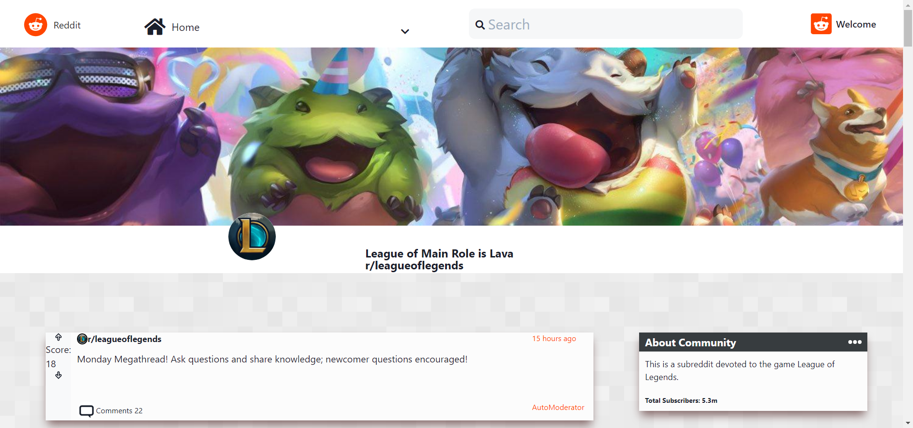
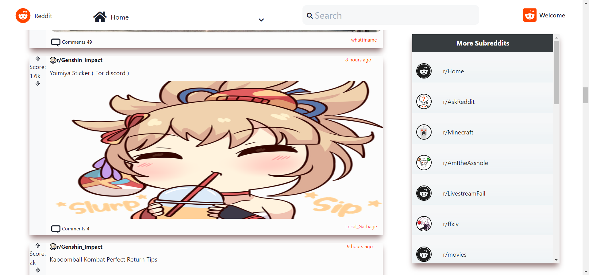
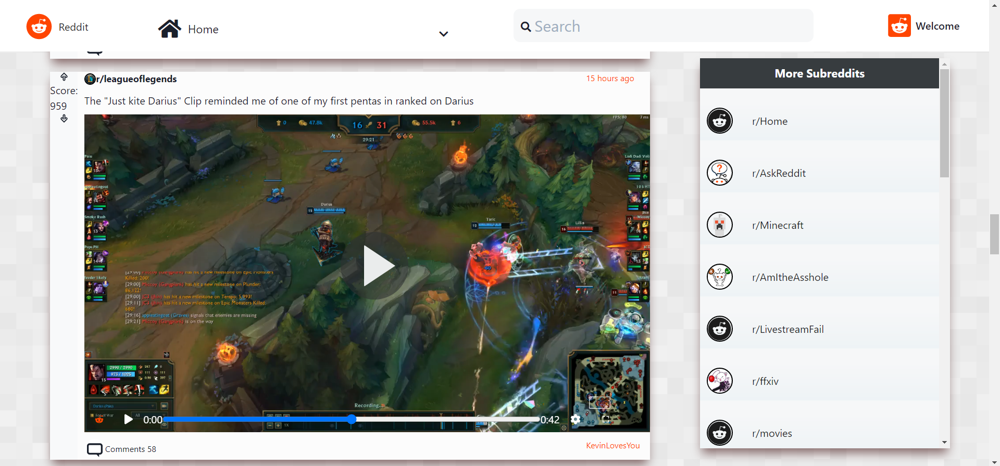
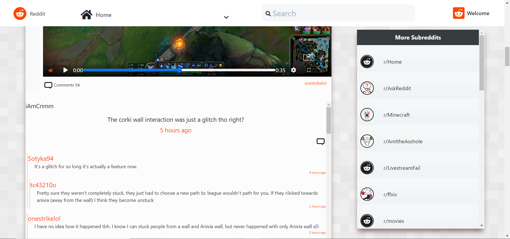
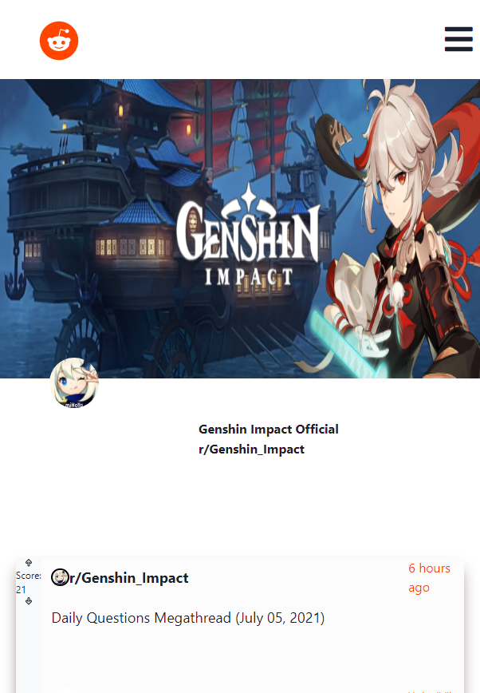

# Reddit Client

This is the main repo codebase for our clone [RedditClientClone](https://customreddit.netlify.app)

Happy Coding!

## Table of Content

- [General Information](https://github.com/CustomHaven/client-reddit#general-information)
- [Screenshots](https://github.com/CustomHaven/client-reddit#screenshots)
- [Technologies](https://github.com/CustomHaven/client-reddit#technologies)
- [Launch](https://github.com/CustomHaven/client-reddit#launch)
- [Status](https://github.com/CustomHaven/client-reddit#status)
- [Contact](https://github.com/CustomHaven/client-reddit#contact)

## General Information

Client is able to:

- View Popular Subreddits with our /dragon extension
- Search for any Subreddits
- View Post Comments as well as their replies
- Works cross platform very responsive on any device

## Screenshots

How the Banner looks:

Example of Cards with images:

Example of Cards with video:

Example of Cards with comments:

Example of Mobile view:

## Technologies

Project is created with:

- JavaScript
- React
- Redux
- CSS

## Launch

To run this project, locally in your environment you can fork it and install it locally then:

> $ cd ../folder
>
> $ npm start

## Status

> Project is: _completed_

## Contact

Created by [@CustomHaven](https://github.com/CustomHaven) feel free to contact me for work or collaboration work.
